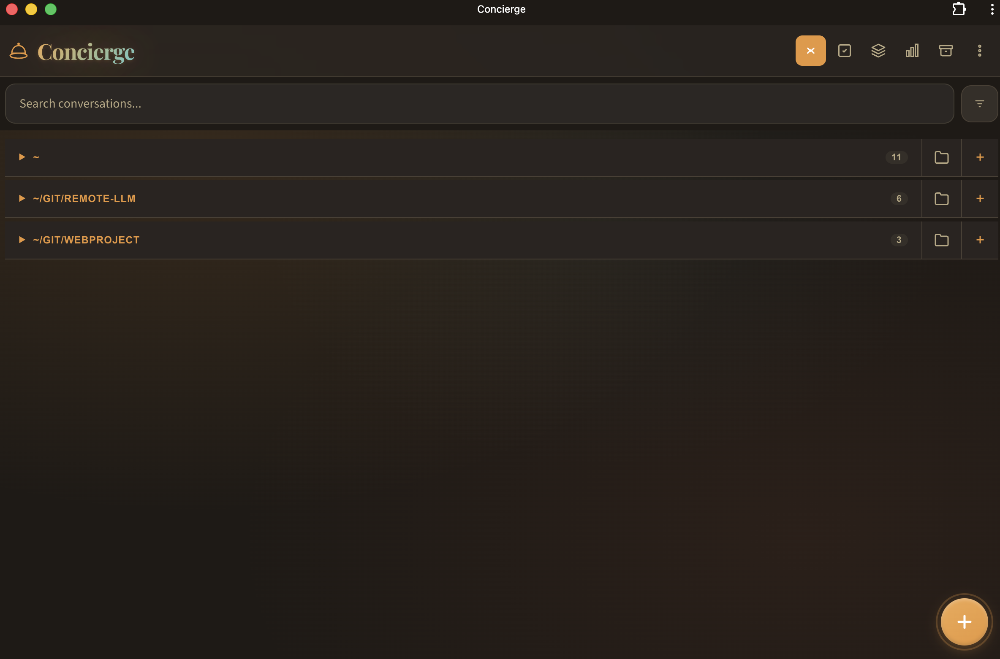

# Concierge

A mobile-first PWA for AI-assisted development. Chat with [Claude Code](https://docs.anthropic.com/en/docs/claude-code), [OpenAI Codex CLI](https://github.com/openai/codex), or local LLMs (via [Ollama](https://ollama.ai)) from your phone, tablet, or any browser. Features real-time streaming, conversation management, git integration, and file preview. Pair with [Tailscale](https://tailscale.com) for secure access from anywhere.



## Features

### Project Integration
- **File browser** - Browse and view files in the conversation's working directory
- **File preview** - View text/code, Markdown, JSON, images, CSV/TSV, Parquet, Jupyter notebooks, and geospatial files inline
- **Geospatial map viewer** - Interactive GeoJSON/JSONL map mode with Map/Raw toggle, basemap switcher, thematic styling, feature hover metadata, and fit-to-bounds controls
- **Git integration** - Full git workflow: status, stage/unstage, commit, push/pull, branches, stash
- **Granular git review** - Accept/reject individual diff hunks (chunk-level stage/discard/unstage)
- **Commit history** - View commits, diffs, revert changes, reset to commit
- **Code search** - Search files with git grep from within the app

### Conversation Management
- **Conversation forking** - Fork from any message to explore alternative paths
- **Branch visualization** - Visual tree of conversation forks with navigation
- **Edit auto-fork** - Editing a message creates a fork instead of losing history
- **Memory system** - Save important context that persists across conversations (global or per-project)

### Multi-Provider Support
- **Claude Code** - Full-featured integration with Claude CLI (default)
- **OpenAI Codex** - Codex CLI integration with GPT-5 Codex models
- **Ollama** - Local LLM support for free, offline conversations
- **Per-conversation provider** - Choose provider and model when creating conversations
- **Provider-specific models** - Access Claude models, Codex models (GPT-5.3/5.2 Codex), or Ollama models (Llama, Mistral, etc.)

### Mobile UX
- **Swipe gestures** - Swipe to reveal actions, swipe back to list
- **Long-press menus** - Context menus for cards and messages
- **Voice input** - Dictate messages using the Web Speech API (requires HTTPS)
- **Text-to-speech** - Listen to Claude's responses read aloud
- **Safe area support** - Proper handling of iOS notch and home indicator

### Desktop Features
- **Keyboard shortcuts** - Cmd+K (search), Cmd+N (new), Cmd+E (export)
- **Desktop notifications** - Get notified when Claude responds while tab is hidden
- **Resizable panels** - Drag to resize the file browser panel

### Search & Stats
- **Full-text search** - Search across conversation names and message content
- **Semantic search** - Find conversations by meaning using local AI embeddings (toggle with sparkle icon)
- **Date & model filters** - Filter search by date range or model
- **Usage dashboard** - Cost tracking, activity charts, streaks, and fun facts

### PWA
- **Offline support** - Service worker caches the app shell for offline access
- **Installable** - Add to home screen on iOS/Android for a native app feel
- **Multiple color themes** - 8 built-in themes (Darjeeling, Budapest, Aquatic, Catppuccin, Fjord, Monokai, Moonrise, Paper) with light/dark variants
- **Light/dark mode** - Auto, light, or dark mode per theme

## Quick Start

```bash
# Install dependencies
npm install

# Start the server
npm start
```

The app runs at `https://localhost:3577` (or `http://` if no certs are configured).

> **Note:** On first use of semantic search, a ~23MB embedding model downloads automatically and is cached locally.

### Prerequisites

- **Node.js** (v18+)
- **Claude CLI** installed and authenticated (`claude` must be available on PATH) — required for Claude provider
- **Codex CLI** installed and authenticated (`codex` must be available on PATH) — required for Codex provider
- **Ollama** (optional) - Install from [ollama.ai](https://ollama.ai) for local LLM support

### HTTPS Setup (required for voice input on non-localhost)

```bash
mkdir -p certs
openssl req -x509 -newkey rsa:2048 \
  -keyout certs/key.pem -out certs/cert.pem \
  -days 365 -nodes -subj '/CN=localhost'
```

The server auto-detects certs and enables HTTPS. Without certs, it falls back to HTTP.

### Remote Access with Tailscale

[Tailscale](https://tailscale.com) is the easiest way to access the app from your phone or anywhere:

1. Install Tailscale on your server and mobile device
2. Generate HTTPS certs: `tailscale cert your-machine.tailnet-name.ts.net`
3. Copy certs to `certs/` (rename to `cert.pem` and `key.pem`)
4. Access via `https://your-machine.tailnet-name.ts.net:3577`

No port forwarding, no exposing to the internet, and you get valid HTTPS certs.

## Usage

1. **Create a conversation** - Tap +, set a name and working directory
2. **Chat** - Messages stream in real time; long-press for actions (fork, edit, copy)
3. **Files & Git** - Use the file panel to browse files, stage changes, commit, and push

## Configuration

| Environment Variable | Default | Description |
|---------------------|---------|-------------|
| `PORT` | `3577` | Server port |
| `OLLAMA_HOST` | `http://localhost:11434` | Ollama API endpoint |

## Tech Stack

- **Backend**: Node.js, Express, WebSocket (`ws`), child_process, @xenova/transformers (embeddings), parquetjs-lite (data files)
- **Frontend**: Vanilla JavaScript, HTML5, CSS3 (no framework, no bundler)
- **Storage**: JSON files on disk (`data/` directory) — conversations, uploads, memories, embeddings
- **PWA**: Service worker with cache-first strategy, web app manifest

## Project Structure

```
concierge/
├── server.js              # Express + WebSocket entry point
├── lib/
│   ├── routes/            # REST API endpoints
│   │   ├── conversations.js  # Conversation CRUD, search, export, fork, compress
│   │   ├── git.js            # Git operations
│   │   ├── files.js          # File browser
│   │   ├── memory.js         # Memory management
│   │   ├── capabilities.js   # Provider/model capabilities
│   │   ├── preview.js        # Live web preview server controls
│   │   ├── duckdb.js         # DuckDB data analysis endpoints
│   │   ├── workflow.js       # Workflow locks + patch queue
│   │   └── helpers.js        # Shared utilities
│   ├── providers/         # LLM provider system
│   │   ├── base.js        # Base provider interface
│   │   ├── claude.js      # Claude CLI provider
│   │   ├── codex.js       # OpenAI Codex CLI provider
│   │   ├── ollama.js      # Ollama provider
│   │   └── index.js       # Provider registry
│   ├── claude.js          # Backwards compat wrapper
│   ├── duckdb.js          # DuckDB query helpers
│   ├── data.js            # Data storage and persistence
│   ├── workflow/          # Locking + patch queue internals
│   └── embeddings.js      # Semantic search with local embeddings
├── public/
│   ├── index.html         # Single-page app HTML
│   ├── style.css          # Main stylesheet (imports CSS modules)
│   ├── js/
│   │   ├── app.js         # Frontend entry point
│   │   ├── state.js       # Shared state management
│   │   ├── ui.js          # UI interactions
│   │   ├── explorer/      # Shared file viewer shell, git controllers, geo preview
│   │   ├── file-panel/    # Conversation-scoped file panel
│   │   ├── files-standalone.js  # Standalone cwd-scoped files/git view
│   │   └── ui/            # Modular UI features (stats, memory, voice, etc.)
│   ├── css/               # Modular stylesheets + themes/
│   ├── sw.js              # Service worker
│   └── manifest.json      # PWA manifest
├── data/                  # Conversations, uploads, memories, embeddings (JSON files)
│   ├── index.json         # Conversation metadata
│   ├── conv/              # Individual conversation messages
│   ├── uploads/           # File attachments
│   ├── memory/            # Global and project-scoped memories
│   └── embeddings.json    # Semantic search vectors
├── certs/                 # Optional HTTPS certificates
├── test/                  # Unit tests
└── docs/
    ├── ARCHITECTURE.md    # System architecture
    └── REFERENCE.md       # Developer quick reference
```

## Testing

```bash
npm test      # Run unit tests
npm run lint  # Run ESLint
```

## Documentation

- [Architecture Guide](docs/ARCHITECTURE.md) - Detailed system design, data flow, APIs, and component breakdown
- [Developer Reference](docs/REFERENCE.md) - Quick-reference for file map, data models, functions, and common patterns

## License

MIT
